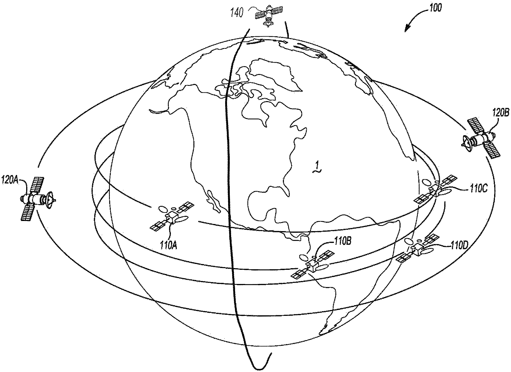
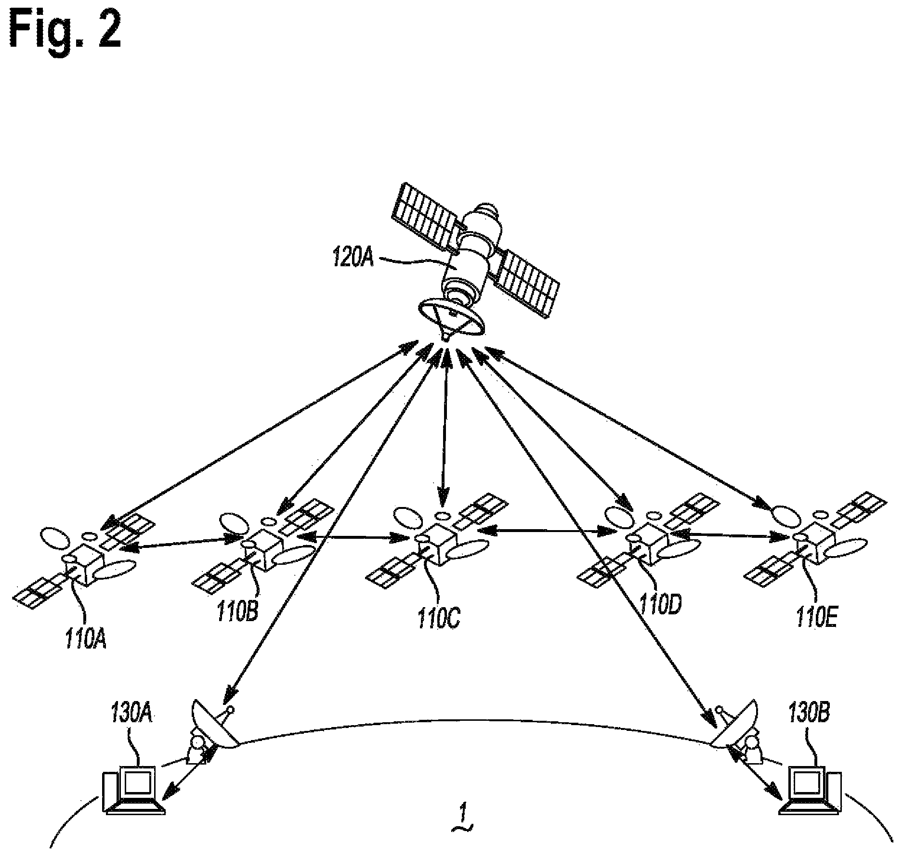
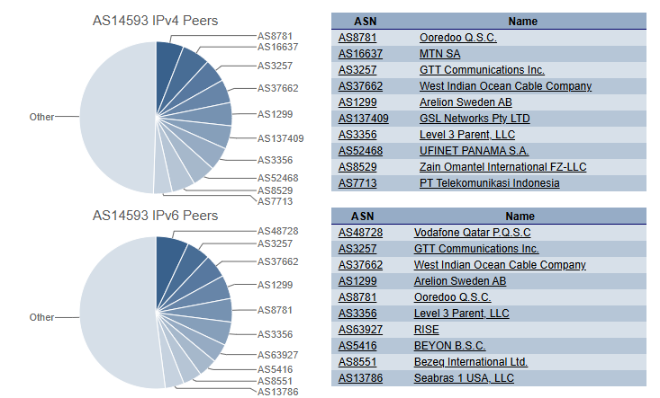
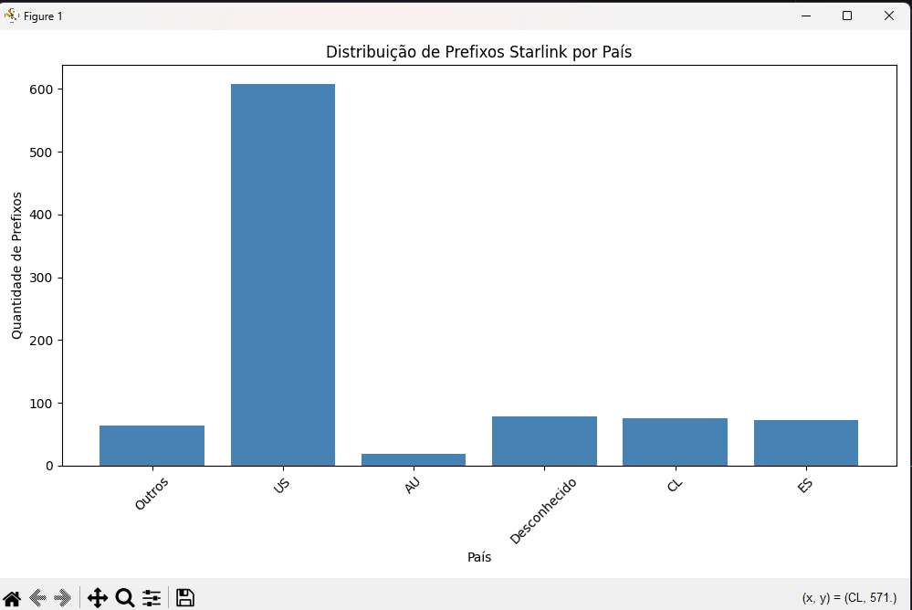

<h1 align="center">🌐 Threat Intelligence: Starlink ASN 14593 OSINT & BGP Analysis 📡</h1>

<p align="center">
  
</p>

---

## 📌 Sobre o Projeto

Este repositório reúne um estudo técnico-operacional sobre a infraestrutura de rede da **Starlink (SpaceX)**, com foco no **ASN 14593**, responsável pela distribuição de endereços IP da rede satelital.

A iniciativa integra técnicas de **OSINT**, **análise forense de rede**, **consultas BGP** e **correlação de indicadores de CGNAT**, contribuindo para investigações de Threat Intelligence, Resposta a Incidentes e mapeamento de infraestrutura satcom.
<p align="center">
  
  
</p>
---

## 🎯 Objetivos

- 📡 Mapear prefixos IPv4 e ASN adjacentes relacionados à Starlink
- 📊 Analisar rotas BGP públicas e dinâmica de atribuição de IPs via CGNAT
- 🛰️ Identificar implicações de tráfego via satélite para segurança ofensiva e defensiva
- 📝 Disponibilizar Playbooks e scripts OSINT para investigação e integração em SIEM/TIP

---

## 📦 Conteúdo do Repositório

- `osint-starlink.md` — Relatório de análise técnica completo
- `prefixos_por_pais.json` — Estatísticas de prefixos por país (contagem e percentual)
- `prefixos_por_pais.csv` — Exportação de estatísticas por país em CSV
- `prefixos_starlink_detalhado.json` — Lista completa de prefixos, país
- `prefixos_starlink_detalhado.csv` — Export detalhado dos prefixos com país
- `starlink_osint_dashboard.py` — Script Python para coleta, agrupamento e gráficos
- `README.md` — Este arquivo de apresentação

---

## 📖 Leitura Rápida

👉 [Clique aqui para visualizar o arquivo `osint-starlink.md`](./osint-starlink.md)

<p align="center">
  
</p>
---

## 📡 Tecnologias e Ferramentas Utilizadas

- 📖 **BGPView API**
- 📖 **bgp.he.net**
- 📖 **ipinfo.io API**
- 📖 **MTR**, **ping**, **whois**
- 📖 **Matplotlib** (gráficos)
- 📖 **Python 3.12+**

---

## 📊 Exemplos de Comando

```bash
whois -h whois.radb.net -- '-i origin AS14593' | grep 'route:'
curl https://ipinfo.io/142.123.0.1
mtr 142.123.0.1
```

---

## 📜 Como Rodar o Script

1. Instale as dependências:

```bash
pip install requests matplotlib
```

2. Execute o script Python:

```bash
python3 starlink_osint_dashboard.py
```

Os gráficos de distribuição por país serão exibidos e os arquivos `prefixos_starlink.csv` e `prefixos_starlink.json` serão gerados no diretório.

<p align="center">
  
  
</p>

---

## 📚 Fontes Técnicas e Documentação

- 📑 [Starlink BGP Table (bgp.he.net)](https://bgp.he.net/AS14593)
- 📑 [BGPView ASN 14593](https://bgpview.io/asn/14593)
- 📑 [Patente US11040786B2 — Starlink Network Architecture](https://patents.google.com/patent/US11040786B2/en)
- 📑 [RFC 6598 — CGNAT Range 100.64.0.0/10](https://datatracker.ietf.org/doc/html/rfc6598)
- 📑 [FCC Starlink Gateways](https://fcc.report/FCC-ID/2AWHPR201)

---

## ⚖️ Licença

Este projeto está sob a licença MIT. Consulte o arquivo `LICENSE` para mais detalhes.

---

## ✒️ Autor

> 📡 Desenvolvido por **Gill3s0x01**  
> 🌎 GitHub: [Gill3s0x01](https://github.com/Gill3s0x01)

---
